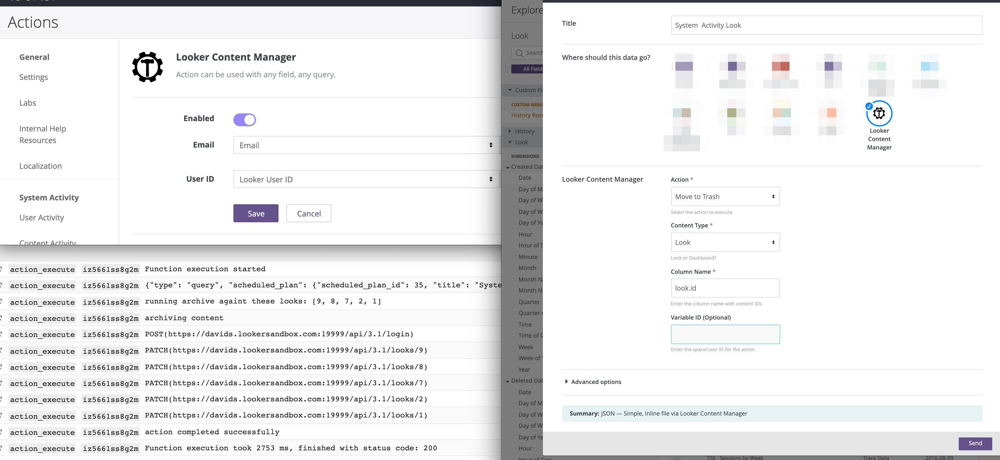

# Looker Content Manager

## Description
This Custom Action performs bulk actions on content, leveraging the Looker API and the System Activity model. It will enable you to select various actions (e.g. Favorite / Unfavorite, Copy / Move to Space, Archive / Restore from Trash) on a list of content IDs. This may be handy when you want to:

- Archive all content that uses a specific model
- Move all content to a space that was created by a specific users
- Assign favorite content to a given user
- Rerun all scheduled plans that have failed

## How to Use
1. Use any Explore to filter to a list of content IDs
2. Send or schedule the data to Custom Action
3. Select the **action** you want to execute and the **content type** (Look or Dashboard). Enter the **column name** which should be used as the content ID (e.g. `dashboard.id` or `look.id`) and the **variable ID** if required.

## Steps to Deploy with Serverless

This action was built using the Serverless framework. It was deployed as a Google Cloud Function, however any of providers listed [here](https://serverless.com/framework/docs/providers/) should work. Check the **serverless.yml reference pages** to know what parameters to tweak.

Before starting the steps below, ensure you have [Serverless installed](https://serverless.com/framework/docs/providers/google/guide/installation/) and Google Cloud [credentials](https://serverless.com/framework/docs/providers/google/guide/credentials/) set up.

1. Rename `serverless_example.yml` to `serverless.yml`
2. Set the provider details:
    - `region` - region to deploy function, e.g. europe-west1
    - `project` - the name of your google cloud project
    - `credentials` - the path to gcf json credentials file, e.g. ~/PATH/TO/GCF_CREDENTIALS.json
3. Set the envirnment variables, refer to [Looker SDK docs](https://github.com/looker-open-source/sdk-codegen#environment-variable-configuration) for guidance on SDK variables:
    - `EXPECTED_LOOKER_SECRET_TOKEN` - can be any random string. This will be used as an auth token set in /admin/actions
    - `CALLBACK_URL_PREFIX` - specify before deploying, e.g. https://REGION_NAME-YOUR_PROJECT_NAME.cloudfunctions.net
    - `LOOKERSDK_API_VERSION` - use "3.1"
    - `LOOKERSDK_BASE_URL` - base url for Looker instance, e.g. https://MY_LOOKER.com:19999
    - `LOOKERSDK_CLIENT_ID`- API3 credentials client_id
    - `LOOKERSDK_CLIENT_SECRET` - API3 credentials client_secret
    - `LOOKERSDK_VERIFY_SSL` - set to false if testing against self-signed certs
4. Run `serverless deploy`
5. In Looker
    - Add the `action_list` endpoint to the /admin/actions page 
    - Enter the expected secret token
    - Enable the action
